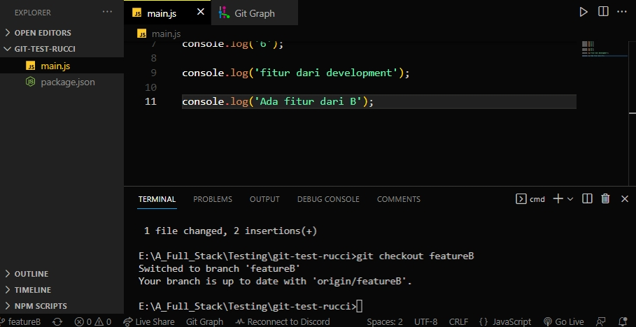

# Praktikum - (03) Basic Version and Branch Management (Git)

  

All code written in javascript

## Link Repository test

https://github.com/DRucci-88/git-test-rucci

## Membuat repository

Menghubungkan proyek pada local dengan git pada server.

## Implementasi penggunaan brancing

Membuat 4 branch yang terdiri dari master, development, featureA dan featureB.

## Implementasi intruksi git untuk push, pull, stash and merge

#### Working Directory

#### Staged Area

#### Commit

#### Push

#### Stash

#### Stash Apply

## Implementasi penanganan konflik

### First setup branch

Membuat kode default pada branch Development. Lalu membuat branch featureA dan featureB berdasarkan branch development serta menambahkan menuliskan kode secara unik untuk memancing terjadinya konflik.

  
  

### Merge branch

Branch development merge dari branch featureA lalu kemudian merge lagi dari branch featureB.

#### Development merge featureA

#### Development merge featureB

#### Mengatasi konflik

#### Hasil final

