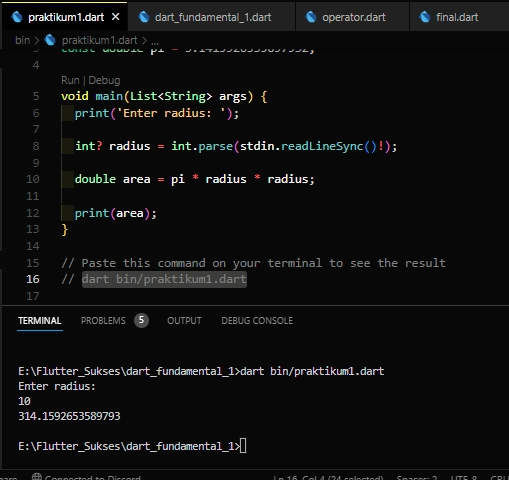
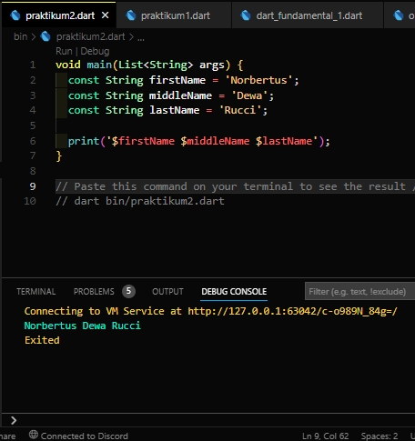

# Soal Latihan Fundamental Mobile Developer 2

Norbertus Dewa Rucci - Kelas A

## Implementasi rumus luas lingkaran pada program Dart

```dart
import 'dart:io';

const double pi = 3.1415926535897932;

void main(List<String> args) {
  print('Enter radius: ');

  int? radius = int.parse(stdin.readLineSync()!);

  double area = pi * radius * radius;

  print(area);
}

// Paste this command on your terminal to see the result
// dart bin/praktikum1.dart
```

<!--  -->


## Buatlah 3 buah variabel yang berisi string, lalu sambungkan seluruh string tersebut, dan tampilkan pada layar!

```dart
void main(List<String> args) {
  const String firstName = 'Norbertus';
  const String middleName = 'Dewa';
  const String lastName = 'Rucci';

  print('$firstName $middleName $lastName');
}

// Paste this command on your terminal to see the result / F5
// dart bin/praktikum2.dart
```

<!--  -->

