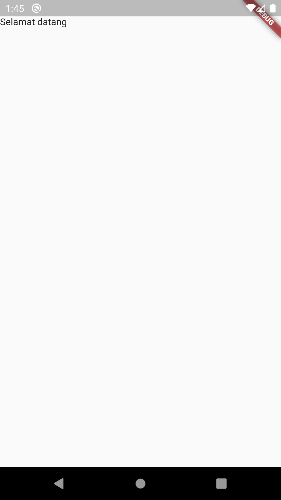

# (13) Platform Widget

## Perkenalan Flutter

Alat pengembangan antarmuka pengguna untuk membuat aplikasi mobile, desktop dan web yang dibuat oleh Google.

Keunggulan

- Mudah digunakan dan dipelajar
- Produktivitas tinggi
- Dokumentasi lengkap
- Komunitas yang berkembang

### Bagian dari Flutter

- Software Development Kit (SDK)

> Alat-alat untuk membantu proses pengembangan aplikasi

- Framework

> Perlengkapan untuk membangun aplikasi yang dapat di kustomisasi, dapat di compile dalam single code base

Memmbuat projecy Flutter `flutter create [nama_project]`

Menjalankan project `flutter run`

### Struktur Direktori

direktori platform

- android
- ios
- web
- linux
- macos

direktori project

- lib, ruang kerja utama
- test, aktivitas pengujian

File utama

- Pertama kali dibaca dan dijalankan
- Dalam direktori lib

```dart
// Bernama main.dart
main.dart
import 'package:flutter/material.dart';

// Memiliki fungsi main, yang merupakan entry point ketika menjalankan aplikasi
// Menjalankan aplikasi dengan fungsi runApp
void main() => runApp(MyApp());
```

## Widget

- Digunakan untuk membentuk antarmuka (UI)
- Berupa class
- Daapat terdiri dari beberapa widget lainnya

Memiliki 2 jenis yakni Stateless Widget dan Stateful Widget

## Stateless Widget

- Tidak bergantung pada peruubahan data
- Hanya fokus pada tampilan
- Dibuat dengan extends pada `class StatelessWidget`
- Tidak memiliki internal state dan hanya sekali saja di build

Membuat Stateless Widget

```dart
import 'package:flutter/material.dart';

void main(List<String> args) {
  runApp(const MyApp());
}

class MyApp extends StatelessWidget {
  const MyApp({Key? key}) : super(key: key);
  @override
  Widget build(BuildContext context) {
    return const MaterialApp(
      home: Scaffold(
        body: SafeArea(child: Text('Selamat Datang di Flutter')),
      ),
    );
  }
}
```

## Stateful Widget

- Mementingkan pada perubahan data
- Dibuat dengan extends pada `class StatefulWidget`
- 1 widget menggunakan 2 class (widget dan state)
- Widget yang berubah secara dynamic

```dart
import 'package:flutter/material.dart';

void main(List<String> args) {
  runApp(const MyApp());
}
class MyApp extends StatefulWidget {
  const MyApp({Key? key}) : super(key: key);

  @override
  State<MyApp> createState() => _MyAppState();
}

class _MyAppState extends State<MyApp> {
  @override
  Widget build(BuildContext context) {
    return const MaterialApp(
      home: Scaffold(
        body: SafeArea(child: Text('Selamat datang')),
      ),
    );
  }
}
```

## Built in Widget

- Widget yang dapat langsund digunakan
- Sudah ter-install bersama Flutter

### Beberapa contoh

- MateriapApp

> Widget yang menggunakan material design yang biasanya digunakan oleh Android development. Dapat menggunakan widget lain yang disediakan oleh MaterialApp.

```dart
  const MaterialApp()
    home: Text('Selamat Datand di Flutter');
  );
  // home adalah property defaultnya
```

- Scaffold

> Membentuk sebuah halaman, dapat menggunakan propery seperti AppBar, Floating Action Button, etc.

```dart
const Scaffold(
  body: Text('Selamat Datang di Flutter');
);
```

- AppBar

> Membantukan application bar yang terletak pada bagian atas halaman

```dart
AppBar(
  title: const Text('Home');
)
```

- Text

> Menampilkan teks

### Contoh Sederhana penggunaan Widget

```dart
import 'package:flutter/material.dart';

void main(List<String> args) {
  runApp(const MyApp());
}
class MyApp extends StatelessWidget {
  const MyApp({Key? key}) : super(key: key);

  @override
  Widget build(BuildContext context) {
    return MaterialApp(
      home: Scaffold(
        appBar: AppBar(
          title: const Text('data'),
        ),
        body: const Text('Selamat Datang di Flutter'),
      ),
    );
  }
}
```

<div align='center'>
  
</div>

<!--  -->
